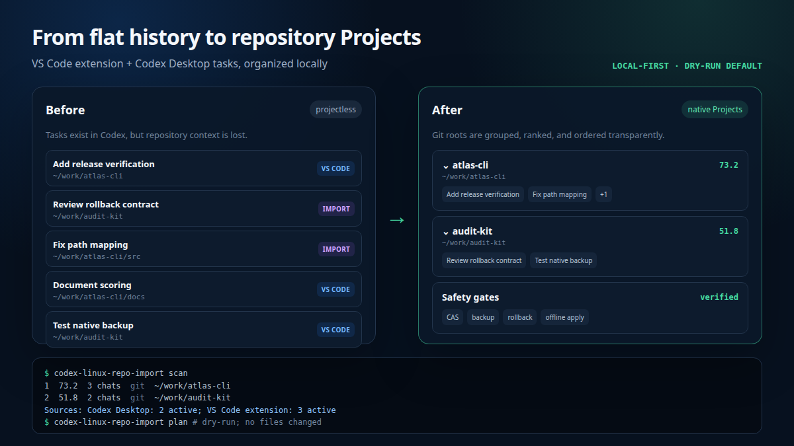

# codex-linux-repo-import

<p align="center">
  
</p>

<p align="center">
  <a href="https://github.com/AdamSkutt/codex-linux-repo-import/actions/workflows/tests.yml"></a>
  <a href="https://github.com/AdamSkutt/codex-linux-repo-import/releases/latest"></a>
  <a href="https://github.com/AdamSkutt/codex-linux-repo-import/stargazers"></a>
  <a href="https://www.python.org/downloads/"></a>
  <a href="LICENSE"></a>
</p>

Bring raw Claude Code history into native Codex tasks, then turn a flat Codex Linux history into Projects grouped by repository or workspace. The grouping flow covers Codex VS Code extension conversations, Codex Desktop parent conversations, and the Claude sessions converted by this tool.

It is local-first, dependency-free at runtime, dry-run first, and designed around source immutability, deduplication, and recovery snapshots.

If this fixes your flat Codex sidebar, [star the repository](https://github.com/AdamSkutt/codex-linux-repo-import) so other Linux Codex users can find it.

> [!IMPORTANT]
> This is an independent, early-stage compatibility tool. It is not an official OpenAI project. Claude conversion uses Codex App Server's experimental external-agent migration API, tested here with Codex CLI `0.133.0`. Native Desktop Project assignment has no public API, so the separate `apply` command uses a version-gated local-state adapter tested only with Linux Codex Desktop `26.803.81509`.

## Before and after

<p align="center">
  
</p>

Before: eligible tasks can exist in Codex but remain projectless or mixed together. After: they appear under native local Projects, with Projects ranked by activity and tasks ordered newest-first.

## 20-second demo

```console
$ codex-linux-repo-import scan
Rank  Score  Chats  Archived  Kind       Apply  Project root
   1   73.2      3         0  git        yes    /home/alice/work/atlas-cli
   2   51.8      2         0  git        yes    /home/alice/work/audit-kit

Sources: Codex Desktop: 2 active, 0 archived; VS Code extension: 3 active, 0 archived

Diagnostics: 0

$ codex-linux-repo-import plan
...
Native change plan
  Projects to create: 2
  Thread assignments to write: 5

Dry-run only. No files were changed.
```

The grouping commands remain unchanged: nothing is written until you fully quit Codex Desktop and explicitly run `apply --yes`.

## Claude Code to Codex

Preview every eligible direct Claude Code session under `~/.claude/projects`:

```bash
codex-linux-repo-import claude plan
```

Import the reviewed set into native Codex history:

```bash
# Fully quit Codex Desktop first.
codex-linux-repo-import claude import --yes
```

The importer enumerates direct session JSONL files itself, so it does not inherit Codex's current default external-agent detection window of 30 days and 50 sessions. It imports one session at a time through Codex's own conversion engine, then verifies Codex's import ledger before reporting success. Already imported files are skipped by exact content hash or compatible legacy import history.

Claude source files are never modified, moved, renamed, or deleted. `claude plan` is read-only. `claude import --yes` creates a private recovery snapshot of relevant Codex state before mutation, rechecks every source hash, and blocks sessions above 16,000 message records unless `--allow-large-sessions` is explicitly supplied.

The recorded workspace directory must still exist. Codex's current Claude parser
treats the `cwd` embedded in the JSONL as authoritative and does not apply a
migration-item path override. The importer therefore blocks moved-workspace
sessions instead of claiming that a remap succeeded or rewriting Claude data.
The separate native Project-grouping commands still support `--map OLD=NEW`.

Use repeatable `--source /absolute/session.jsonl` options to transfer only selected sessions. An alternate `--claude-projects` path can be inspected by `claude plan`, but Codex App Server currently imports only from the active user's real `~/.claude/projects`; the tool refuses to shadow `HOME`. After conversion, run the normal `plan` and `apply --yes` flow if you also want the new Codex tasks grouped into native Projects. See [Claude Code import](docs/CLAUDE-IMPORT.md) for the exact data, safety, and compatibility contract.

## What it does

- Discovers all direct Claude Code session files, including old sessions outside Codex's default detector window.
- Converts reviewed Claude sessions through Codex App Server's native external-agent migration path; no home-grown transcript format is written.
- Deduplicates imports, validates workspace paths, blocks unsafe sources, and takes a private recovery snapshot before Codex mutation.
- Finds eligible parent conversations from the Codex VS Code extension and Codex Desktop, including native external-agent imports.
- During the separate grouping flow, reads only the first `session_meta` line of each native Codex JSONL session file. Prompts, responses, commands, patches, and tool output are never read by that scanner.
- Resolves each recorded working directory to a Git root, or to the exact workspace directory when it is not a Git repository.
- Groups conversations into native local Projects and ranks Projects by frequency, recency, active days, history span, and continuity.
- Reports provenance as `vscode-extension` or `codex-desktop`. The latter can include both direct Desktop tasks and native external-agent imports, so no provider is guessed.
- Can optionally collect conversations whose original workspace is missing or too broad into one native `Unlinked Codex Chats` Project.
- Produces a dry-run plan by default, creates a verified backup before every apply, and supports guarded rollback.

Raw external-agent conversion currently supports **Claude Code session history only**. It does not ingest Claude Cowork/Desktop, Cursor, Gemini, or arbitrary chat exports. It never modifies Claude source JSONL. The Project-grouping flow never modifies native Codex rollout JSONL or the thread SQLite database; the Claude import flow asks Codex App Server to create those native artifacts.

## Requirements

- Linux
- Python 3.11 or newer
- Git, for repository-root detection
- Codex CLI with the experimental external-migration capability; `0.133.0` is the tested Claude-import version
- Codex Desktop `26.803.81509` for the tested apply path
- Codex Desktop fully quit before `claude import`, `apply`, or `rollback` writes

Both `claude plan` and the Project `scan`/`plan` commands are read-only. On an untested Desktop version, Project assignment is refused by default even if the state shape looks compatible. See [Compatibility](docs/COMPATIBILITY.md).

## Install and run

Install directly from GitHub with `pipx`:

```bash
pipx install git+https://github.com/AdamSkutt/codex-linux-repo-import.git
codex-linux-repo-import doctor
codex-linux-repo-import claude plan
codex-linux-repo-import scan
codex-linux-repo-import plan
```

Or run without installing:

```bash
git clone https://github.com/AdamSkutt/codex-linux-repo-import.git
cd codex-linux-repo-import

./codex-linux-repo-import doctor
./codex-linux-repo-import claude plan
./codex-linux-repo-import scan
./codex-linux-repo-import plan
```

Review the displayed roots and change summary. If they are correct, fully quit Codex Desktop and apply the same plan options:

```bash
codex-linux-repo-import apply --yes
```

Restart Codex Desktop. Eligible conversations should now appear under native local Projects in the left sidebar.

## Supported conversation provenance

Eligibility is deliberately exact:

| Provenance | First-record metadata | Included |
| --- | --- | --- |
| VS Code extension | `originator=codex_vscode`, `source=vscode` | Yes |
| Codex Desktop parent | `originator=Codex Desktop`, `source=vscode` | Yes, reported as `codex-desktop` |
| Subagent or fork worker | `source` is an object | No |
| Ordinary Desktop/CLI/exec task | Any other exact pair | No |

The same exact Desktop metadata pair appears on direct Desktop tasks and native external-agent imports. The tool therefore reports the honest common provenance and never labels a task as Claude or Cursor based on a guess. See [ADR-001](docs/ADR-001-SESSION-PROVENANCE.md).

## Common options

Use `--map OLD=NEW` when a workspace moved. The option can be repeated:

```bash
codex-linux-repo-import plan \
  --map /old/location/project=/new/location/project
```

By default, archived conversations are reported but are neither assigned nor counted in ranking. To assign archived conversations too:

```bash
codex-linux-repo-import plan --include-archived
codex-linux-repo-import apply --include-archived --yes
```

The weighted Project order requires the native sidebar's manual Project sort mode, which the tool enables by default. Keep the current native Project sort preference with `--preserve-native-sort`.

Existing task assignments are treated as conflicts and left unchanged. Use `--reassign` only after reviewing the plan if you deliberately want to replace them.

### Optional fallback for unlinked conversations

Some eligible conversations cannot be grouped automatically because their recorded workspace no longer exists or is a broad location such as the Desktop. To collect those active conversations into one native Project, opt in with a dedicated target directory:

```bash
codex-linux-repo-import plan \
  --unlinked-project-root "/home/alice/Desktop/Unlinked Codex Chats"

# Fully quit Codex Desktop and apply the exact plan you reviewed.
codex-linux-repo-import apply \
  --unlinked-project-root "/home/alice/Desktop/Unlinked Codex Chats" \
  --yes
```

The flag is available only for `plan` and `apply`; there is no implicit fallback. `plan` remains read-only, including when the target leaf does not exist. `apply` creates that one private `0700` leaf directory when safe and gives the native Project the fixed name `Unlinked Codex Chats`.

Only conversations from `missing` and `ambiguous` roots enter this fallback. Valid repository/workspace groups remain separate, unresolved paths remain untouched, and existing assignments are never moved into the fallback—even with `--reassign`.

The target must be an absolute, dedicated direct child of the existing `~/Desktop` directory. Do not point it at a repository, an unrelated directory, the Codex data directory, or a directory containing personal files. The importer never removes this directory, including after a failed apply or rollback. Read [Safety and recovery](docs/SAFETY.md) before using it.

Run any command with `--help` for all options. `doctor`, `scan`, `plan`, and `backups` accept `--json`. A JSON plan contains exact local paths and native task/Project identifiers; keep it private.

## Backups and rollback

```bash
codex-linux-repo-import backups

# Fully quit Codex Desktop first.
codex-linux-repo-import rollback BACKUP_ID --yes
```

For Project assignment, rollback is conflict-aware: if Codex changed an importer-owned state key after the apply, restoration stops instead of overwriting newer state. A second safety backup is created before rollback.

Claude import snapshots appear in `backups` with kind `claude-session-import`, but the automatic `rollback` command intentionally accepts only Project-assignment backups. Native session conversion touches a wider Codex-owned data model; restoring a Claude snapshot is a manual last-resort recovery procedure, not a routine undo. See [Safety and recovery](docs/SAFETY.md).

## How grouping works

For every eligible session, the tool uses the `cwd` recorded in the first metadata record:

1. Apply explicit `--map OLD=NEW` mappings.
2. Resolve symlinks and use the enclosing Git root when one exists.
3. Otherwise use the exact existing workspace directory.
4. Leave missing paths and broad roots, such as home or Desktop, ineligible for automatic grouping.
5. If explicitly requested, merge only `missing` and `ambiguous` candidates into the unranked fallback Project.

Clones stay separate by local path; repositories are not merged by remote URL. This keeps grouping deterministic and avoids guessing user intent. See [Project scoring](docs/SCORING.md) for the ranking formula.

## Why a compatibility adapter is necessary

OpenAI's public documentation describes [Projects](https://learn.chatgpt.com/docs/projects) and the [Codex App Server](https://learn.chatgpt.com/docs/app-server), but the current public App Server interface does not expose a supported operation for assigning existing historical Desktop tasks to a native local Project. The open-source [App Server protocol reference](https://github.com/openai/codex/blob/f317dc8a17d30d8feb2c79add1d9d565be0402bf/codex-rs/app-server/README.md) likewise documents task operations, not this Desktop-specific assignment.

Write operations are therefore conservative: strict state validation, an exact tested-version gate, an app-running guard, compare-and-swap checks, backups, atomic writes, and post-write verification. The contract is documented in [Compatibility](docs/COMPATIBILITY.md).

## Privacy

The native Codex grouping scanner reads each candidate rollout only far enough to parse its first JSONL record. It uses allowlisted metadata such as task ID, timestamp, working directory, originator, source, and fork parent ID. It never inspects conversation content.

Claude conversion necessarily has a different boundary: the planning pass streams every selected Claude JSONL record to hash the file and inspect structural metadata, and Codex App Server then reads the conversation content to create a native Codex task. Message content is not placed in plan output, diagnostics, or backup manifests. The source file itself remains byte-for-byte unchanged, while the newly created native Codex rollout contains the imported conversation by design.

Plain-text output displays local project paths. JSON plans can contain local source paths and native task/Project identifiers, and backups contain native state. Treat these artifacts as private and do not publish them in bug reports.

Repository artwork and demo output use synthetic names and paths only. The self-contained HTML sources make no external requests.

## Contributing

Bug reports and narrowly scoped compatibility evidence are welcome. Include the tool version, Codex Desktop version, command used, and redacted error text. Never attach session files, native state, plans, backups, usernames, or full filesystem paths.

Compatibility changes should include synthetic fixtures and tests. Do not submit captured personal state.

## License

[MIT](LICENSE)
