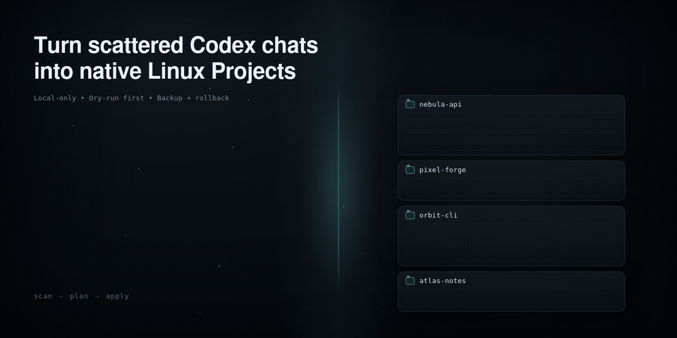

# codex-linux-repo-import

<p align="center">
  
</p>

<p align="center">
  <a href="https://github.com/AdamSkutt/codex-linux-repo-import/actions/workflows/tests.yml"></a>
  <a href="https://www.python.org/downloads/"></a>
  <a href="LICENSE"></a>
</p>

<p align="center">
  <a href="assets/codex-linux-repo-import-hero.html">Animation source (HTML)</a> ·
  <a href="assets/codex-linux-repo-import-hero.png">Social preview (PNG)</a>
</p>

Bring chats created by the Codex VS Code extension into the native Linux Codex Projects sidebar, grouped by their repository or workspace and ordered by a transparent activity score.

> [!IMPORTANT]
> This is an independent, early-stage compatibility tool. It is not an official OpenAI project. Native Desktop project assignment currently has no public API, so `apply` uses a version-gated adapter for the local Desktop state format. The adapter is tested only with Linux Codex Desktop `26.803.81509`.

## What it does

- Finds chats created specifically by the Codex VS Code extension.
- Reads only the first `session_meta` line of each JSONL session file. Message bodies and tool output are never read.
- Resolves each chat's original working directory to a Git root, or to the exact workspace directory when it is not a Git repository.
- Groups chats into native local Projects and orders Projects by frequency, recency, active days, history span, and continuity.
- Can optionally collect chats whose original workspace is missing or too broad to identify safely into one native `Unlinked Codex Chats` Project.
- Orders imported chats inside each Project from newest to oldest.
- Produces a dry-run plan by default; nothing changes until you explicitly run `apply --yes`.
- Creates a verified backup before every apply and supports guarded rollback.

It does **not** modify, move, or rewrite session JSONL files.

## Requirements

- Linux
- Python 3.11 or newer
- Git, for repository-root detection
- Codex Desktop `26.803.81509` for the tested apply path
- Codex Desktop must be fully quit before `apply` or `rollback`

Scanning and planning are read-only. On an untested Desktop version, applying is refused by default even if the state shape looks compatible. See [Compatibility](docs/COMPATIBILITY.md).

## Quick start from a source checkout

No package installation is required:

```bash
git clone https://github.com/AdamSkutt/codex-linux-repo-import.git
cd codex-linux-repo-import

./codex-linux-repo-import doctor
./codex-linux-repo-import scan
./codex-linux-repo-import plan
```

Review the displayed roots and change summary. If it is correct, fully quit Codex Desktop and then apply it:

```bash
./codex-linux-repo-import apply --yes
```

Restart Codex Desktop. The eligible VS Code extension chats should now appear under native local Projects in the left sidebar.

## Common options

Use `--map OLD=NEW` when a workspace moved. The option can be repeated:

```bash
./codex-linux-repo-import plan \
  --map /old/location/project=/new/location/project
```

By default, archived chats are reported but are neither assigned nor counted in ranking. To assign archived chats too:

```bash
./codex-linux-repo-import plan --include-archived
./codex-linux-repo-import apply --include-archived --yes
```

The weighted Project order requires the native sidebar's manual Project sort mode, which the tool enables by default. Keep the current native Project sort preference instead with `--preserve-native-sort`.

Existing thread assignments are treated as conflicts and left unchanged. Use `--reassign` only after reviewing the plan if you deliberately want to replace them.

### Optional fallback for unlinked chats

Some extension chats cannot be grouped automatically because their recorded workspace no longer exists or is a broad location such as the Desktop. To collect those active chats into one native Project, opt in with a dedicated target directory:

```bash
./codex-linux-repo-import plan \
  --unlinked-project-root "/home/alice/Desktop/Unlinked Codex Chats"

# Fully quit Codex Desktop and apply the exact plan you reviewed.
./codex-linux-repo-import apply \
  --unlinked-project-root "/home/alice/Desktop/Unlinked Codex Chats" \
  --yes
```

The flag is available only for `plan` and `apply`; there is no implicit fallback when it is omitted. `plan` remains read-only, including when the target leaf does not exist. `apply` creates that one private `0700` leaf directory when it is safe to do so and gives the native Project the fixed name `Unlinked Codex Chats`.

Only chats from `missing` and `ambiguous` roots enter this fallback. Chats with a valid repository/workspace root remain in their normal Project, and unresolved paths remain untouched. The native thread catalog must be available. Existing assignments are never moved into the fallback, even with `--reassign`.

Archived fallback chats are excluded by default. The existing `--include-archived` option includes them explicitly, just as it does for normal Projects. The fallback is unranked; a newly created fallback is placed after the weighted repository/workspace Projects, while a reused fallback keeps its existing position.

The target must be an absolute, dedicated direct child of the existing `~/Desktop` directory; the leaf may be missing or may already be a safe, dedicated directory. Do not point it at a repository, an existing unrelated directory, the Codex data directory, or any directory containing personal files. Read [Safety and recovery](docs/SAFETY.md) for target validation and rollback behavior.

For deletion safety, the importer never removes this directory—not after a failed apply and not during rollback. A directory created just before an interruption can be reused by a fresh plan/apply when it is still empty. Inspect it yourself before any manual removal.

Run any command with `--help` for its complete options.

For machine-readable output, `doctor`, `scan`, `plan`, and `backups` accept `--json`. Use `plan --json` when you need the full structured change set, but note that it contains exact local paths and native thread/Project identifiers. Treat that output as private and do not attach it to public issues.

## Backups and rollback

List importer backups:

```bash
./codex-linux-repo-import backups
```

To undo an apply, fully quit Codex Desktop and restore the selected backup:

```bash
./codex-linux-repo-import rollback BACKUP_ID --yes
```

Rollback is conflict-aware: if Codex changed an importer-owned state key after the import, restoration stops instead of overwriting that newer state. A second safety backup is created before rollback.

Read [Safety and recovery](docs/SAFETY.md) before using write commands.

## How grouping works

For every matching extension session, the tool uses the `cwd` recorded in the first metadata record:

1. Apply any explicit `--map OLD=NEW` mapping.
2. Resolve symlinks and use the enclosing Git root when one exists.
3. Otherwise use the exact existing workspace directory.
4. Leave missing paths and roots that are too broad, such as the home directory, ineligible for automatic repository/workspace grouping.
5. When `--unlinked-project-root PATH` is explicitly supplied, merge active chats from only those `missing` and `ambiguous` groups into the unranked fallback Project; `--include-archived` expands that selection explicitly.

Clones are kept separate by local path; repositories are not merged by remote URL. This keeps grouping deterministic and avoids guessing user intent.

See [Project scoring](docs/SCORING.md) for the ranking formula and tie-break rules.

## Why a compatibility adapter is necessary

OpenAI's public documentation describes [Projects](https://learn.chatgpt.com/docs/projects) and the [Codex App Server](https://learn.chatgpt.com/docs/app-server), but the current public App Server interface does not expose a supported operation for assigning existing Desktop threads to a native local Project. The open-source [App Server protocol reference](https://github.com/openai/codex/blob/f317dc8a17d30d8feb2c79add1d9d565be0402bf/codex-rs/app-server/README.md) likewise documents thread operations, not this Desktop-specific historical assignment.

For that reason, write operations are deliberately conservative: strict state validation, a tested-version gate, an app-running guard, compare-and-swap checks, backups, atomic writes, and post-write verification. The exact state keys and compatibility policy are documented in [Compatibility](docs/COMPATIBILITY.md).

## Privacy

The scanner reads a session file only far enough to parse its first JSONL record. It uses metadata such as thread ID, timestamp, working directory, originator, and source. It does not inspect prompts, responses, commands, patches, or other conversation content.

The plain-text scan and plan display local project paths. A `plan --json` result additionally contains native thread/Project identifiers, and backups contain native state. Treat all of these artifacts as private local data and do not publish them in bug reports.

The repository artwork uses synthetic Project and chat names only. It contains no captured session data or local filesystem paths. Its self-contained HTML source makes no external network requests for the included animation.

## Contributing

Bug reports and narrowly scoped compatibility evidence are welcome. Please include the tool version, Codex Desktop version, command used, and redacted error text. Do not attach session files, native state files, plans, backups, usernames, or full filesystem paths.

Compatibility changes should include synthetic fixtures and tests. Do not submit captured personal state.

## License

[MIT](LICENSE)
